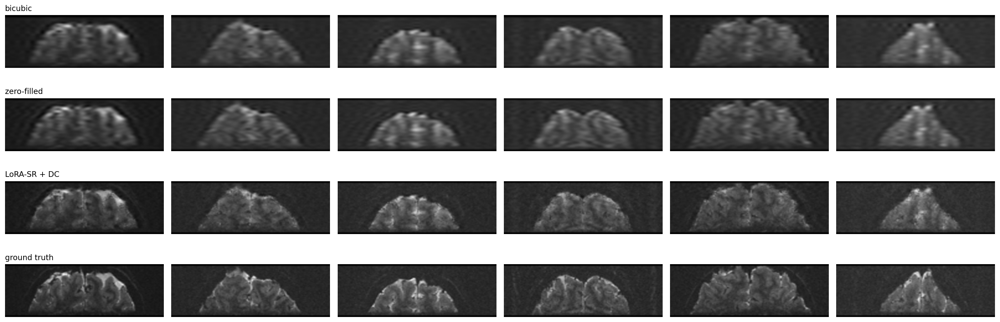
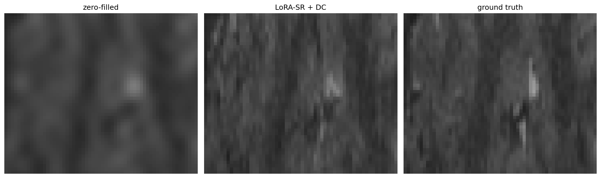
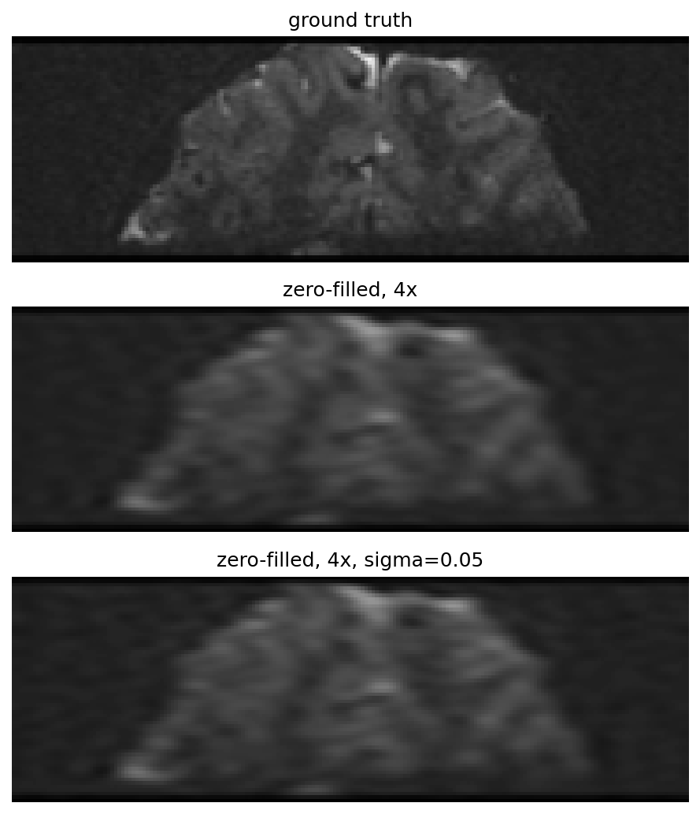

# LoRA-Conditioned Diffusion Super-Resolution for fMRI-EPI

Turning an **unconditional** brain-MRI diffusion prior into a **conditional super-resolution**
model with LoRA — 11 % of parameters trained, base weights untouched.

Evaluated against zero-filled reconstruction, bicubic interpolation, and DDRM driven by the
same prior, on 288 held-out slices under a physically realistic k-space forward model.

---

## Results

288 held-out slices (`sub-17..22`), 4× k-space truncation, 128×128.

| Method | PSNR (dB) ↑ | SSIM ↑ | LPIPS ↓ |
|---|---|---|---|
| Bicubic (31 → 128) | 25.87 | 0.676 | 0.399 |
| Zero-filled reconstruction | **28.88** | **0.774** | 0.369 |
| DDRM + same prior | 28.41 | 0.758 | 0.131 |
| LoRA-SR | 28.36 | 0.738 | **0.129** |
| LoRA-SR + data consistency | 28.54 | 0.746 | 0.129 |

**The ranking inverts with the metric.** PSNR and SSIM order the methods
`ZF > DDRM > LoRA-SR > bicubic`; LPIPS orders them `LoRA-SR ≈ DDRM ≫ ZF > bicubic`.

This is not a measurement artefact. Under k-space truncation the forward operator has unit
singular values, so zero-filling reproduces every *measured* frequency exactly and assigns
zero to the rest — the minimum-energy, MSE-optimal choice. Any generative method must predict
the unmeasured band well enough to beat "predict nothing". Both diffusion-based methods pay
~0.4 dB for a 2.8× LPIPS improvement: the perception-distortion trade-off
(Blau & Michaeli, 2018), measured on a realistic MR degradation.

**Two paradigms, one outcome.** DDRM solves an inverse problem — it is *given* the operator
`H` and inverts it through its SVD. The LoRA model never sees `H` and learns the mapping from
data. They land within 0.002 LPIPS of each other. Since both use the same prior, the result
is attributable to the prior rather than to the solver.

### Qualitative comparison



The texture difference is not visible at thumbnail scale. Zoomed into a cortical region:



Zero-filled input is smooth; the adapted model reproduces the grainy, directionally
structured texture of the ground truth. The texture is statistically correct but not
pixel-aligned — exactly what PSNR penalises and LPIPS rewards.

---

## Method

### Base model

A DDPM (`ermongroup/ddim` architecture, `ch=64`, `ch_mult=[1,2,2,2]`, attention at 16×16,
**8.95 M** parameters) trained from scratch for 164 k steps on `sub-01..16`. EMA weights only.

### Adaptation

| Component | Treatment | Why |
|---|---|---|
| `conv_in` | 1 → 2 channels, new channel **zero-init**, fully trainable | A low-rank update to a zero channel stays zero — the conditioning path would never learn |
| Attention `q,k,v,proj_out` | LoRA, r=16, α=32 | Standard target |
| ResBlock `conv1,conv2,nin_shortcut` | LoRA, r=16, α=32 | Attention is only 4.4 % of this UNet; attention-only LoRA touches too little to teach a new task |
| Everything else | Frozen | — |

**1,150,144 / 10,100,481 trainable (11.4 %).** High for LoRA, and deliberately so: this is a
*task* change (unconditional generation → conditional restoration), not a style transfer.

Zero-initialising the new input channel means the network reproduces the original prior
*exactly* at step 0 — verified in the notebook by feeding arbitrary noise into the LR channel
and observing a bit-identical output. The conditioning pathway grows from nothing.

### Forward operator

A low-resolution MR acquisition samples fewer k-space lines, so the correct forward model is
frequency-domain truncation, not spatial averaging. The operator is implemented in the
**discrete Hartley transform** basis (`cas(x) = cos(x) + sin(x)` — real, symmetric,
self-inverse), which for a frequency set closed under `u ↔ N−u` is exactly equivalent to
k-space truncation.

Unit tests in the notebook:

| Test | Error |
|---|---|
| Orthonormality, `T @ T = I` | 2.7e-05 |
| Hartley truncation == FFT truncation | 3.9e-05 |
| Idempotence, `H(H(x)) = H(x)` | 2.3e-05 |

Retained coefficient fraction is 0.0587 rather than 1/16 = 0.0625 because the Nyquist index
is its own conjugate partner and falls outside the kept set.

The same operator generates the training inputs, the evaluation inputs, and the DDRM
degradation — so every method in the table sees an identical measurement.



Gibbs ringing at tissue boundaries is the signature of frequency truncation, distinct from
the smooth blur of spatial downsampling.

### Sampling

Two departures from textbook DDIM, both of which mattered:

- **Warm start.** Initialising from pure noise wastes the sampler regenerating a brain that is
  already partially observed, and accumulates error over ~1000 steps. Noising the zero-filled
  reconstruction to `t_start = 100` instead (SDEdit-style) raised held-out PSNR from
  **20.6 → 28.6 dB**.
- **Return `x₀`, not `x`.** The final iterate still carries residual noise.

### Data consistency

Measured Hartley coefficients are taken from the acquisition, unmeasured ones from the model.
Standard in MR reconstruction (cf. Chung & Ye, 2022). Worth +0.18 dB, and it bounds
hallucination to the unmeasured band — the model cannot corrupt what was actually measured.

---

## Why not a pretrained upscaler?

The original plan was to LoRA-adapt `stabilityai/stable-diffusion-x4-upscaler`. It was
abandoned on measurement, not intuition:

| Finding | Number |
|---|---|
| VAE round-trip ceiling at 128×128 | 38.33 dB / SSIM 0.954 — not the bottleneck |
| Zero-shot upscaler, 32 → 128 | **18.09 dB** vs 29.06 dB for bicubic |
| Brain at design scale, 128 → 512 | Plausible output |
| Natural image at our scale, 32 → 128 | Distorted output |

A 2×2 control (brain/natural × design-scale/target-scale) isolates the cause: the model fails
at 32 → 128 **in its own domain**, so the obstacle is resolution mismatch, not domain shift.
The upscaler is built for a 128×128 latent; at 128-pixel output the latent is 32×32 — 1/16 the
design area.

And the resolution gap cannot be closed from the data side: `ds001168` volumes are
`(200, 60, 40, 150)`, so the largest true slice is 200×60. There is no 512 anywhere, and
manufacturing one by upsampling would be a fabricated reference.

Hence a domain-specific prior at native resolution, with no VAE, single-channel, and no
scale mismatch.

---

## Data

[OpenNeuro `ds001168`](https://openneuro.org/datasets/ds001168) — 7T prefrontal EPI,
0.75 mm isotropic.

- 22 subjects × 2 sessions
- **Subject-wise split** (no leakage): `sub-01..16` train (768 slices),
  `sub-17..22` test (288 slices)
- Preprocessing: 200×60 slice → crop width to 192 → pad height to 64 → per-slice normalise →
  uint8 PNG → resize to 128×128 for training

fMRI-EPI is a harder modality for super-resolution than anatomical T1: low SNR, susceptibility
distortion (worst in prefrontal regions), and BOLD-optimised rather than tissue-optimised
contrast. Some of the ground-truth high-frequency content is thermal noise, which is
unpredictable by construction and caps achievable PSNR.

---

## Usage

```bash
git clone https://github.com/ermongroup/ddim     # architecture definition
pip install torch peft lpips scikit-image matplotlib pyyaml pillow
```

Open `lora_conditional_sr.ipynb` and edit the paths in section 0. Training is ~1 hour on an
RTX 5070 Ti Laptop (12.8 GB); peak VRAM under 3 GB at batch 16 with fp16 — no gradient
checkpointing or 8-bit optimiser needed.

On Windows, keep `num_workers = 0` (multiprocessing pickling fails). The dataset is preloaded
onto the GPU (~50 MB), which removed a ~40 % throughput loss from per-batch PIL decoding.

Figures are written to `results/` as the notebook runs.

```
.
├── lora_conditional_sr.ipynb
├── README.md
└── results/
    ├── prior_samples.png            # sanity check: the prior generates brains
    ├── degradation_operator.png     # forward model, with and without noise
    ├── training_loss.png
    ├── qualitative_comparison.png   # 4 methods x 6 held-out slices
    └── zoom_texture.png             # cortical detail, ZF vs LoRA-SR vs GT
```

---

## Limitations

- Reconstructed texture is *statistically* plausible, not *anatomically* verified. In a
  clinical setting, plausible-but-invented structure is a serious failure mode. Data
  consistency bounds hallucination to the unmeasured band but does not eliminate it.
- LPIPS uses an AlexNet trained on natural images; its calibration on MR is not established.
  Reported because it is the field standard, not because it is validated here.
- Native slice geometry is 192×64, resized to 128×128 — aspect ratio is distorted. All
  methods share this preprocessing, so comparisons hold, but absolute numbers are tied to it.
- Retrospective evaluation: LR data is simulated from fully-sampled images, not prospectively
  undersampled on a scanner.
- Single acceleration factor (4×) and a single `t_start`. A sweep over `t_start` would trace
  the perception-distortion curve directly.
- DDRM and LoRA-SR do not use the same information: DDRM **knows** `H`, LoRA-SR does not.

---

## References

- Hu et al., *LoRA: Low-Rank Adaptation of Large Language Models*, 2021.
- Ho et al., *Denoising Diffusion Probabilistic Models*, NeurIPS 2020.
- Song et al., *Denoising Diffusion Implicit Models*, ICLR 2021.
- Kawar et al., *Denoising Diffusion Restoration Models*, NeurIPS 2022.
- Chung & Ye, *Score-based diffusion models for accelerated MRI*, Medical Image Analysis, 2022.
- Meng et al., *SDEdit: Guided Image Synthesis and Editing with Stochastic Differential Equations*, ICLR 2022.
- Blau & Michaeli, *The Perception-Distortion Tradeoff*, CVPR 2018.
